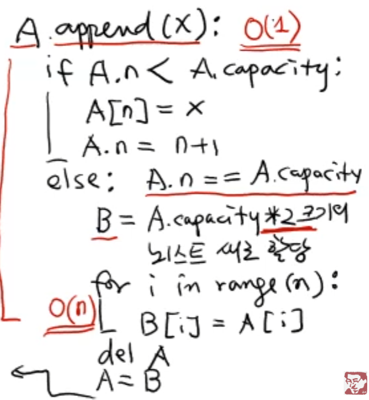
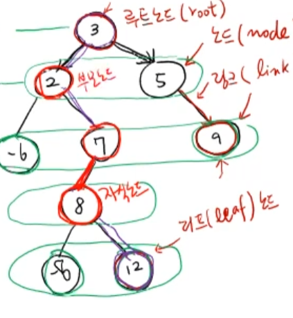

# data-structures 1주차
자료구조,알고리즘 시간 복잡도
1. 모든 입력에 대해 기본연산 횟수를 더한 후 평균
    -> 현실적으로 불가능함
2. 가장 안 좋은 입력(Worstcase input)에 대란 기본 연산 횟수를 측정(Worstcase time complexity)
    -> 어떤 입력에 대해서도 W.T.C보다 수행시간이 크지 않음
    -> 여러 코드중 최악의 경우의 입력에대한 기본연산횟수가 작은것을 선택
    -> Big-O 표기
    -> 함수값을 결정하는 최고차항만으로 간단하게 표기
         1.최고차항만 남기기
         2.최고차항 계수(상수)는 생략
         3.Big-O(최고차항)
         Ex)
         T1(n) = 2n-1 -> T1(n)=O(n)
         T2(n) = 4n+1 -> T2(n)=O(n)
         T3(n) = (2/3)n²-(2/3)n+1 -> T3(n)=O(n²)
         T4(n) = 1 -> T4(n)=O(1)
         T5(n) = c*log2(N)+1 -> T5(n)=O(log2(N))

# data-structures 2주차
배열(array) vs 리스트(list)
- 가장 기본적인 자료구조(순차적)
[list]
A[2]=0, A[2]=A[2]+1 을 했을때 A[2]는 1이라는 새로운 객체 지정
A.append(6): 맨뒤에 6 삽임 == 6이라는 객체가 어딘가에 저장되어 그것을 가르킴
A.coumt(value) == list에서 몇번 등장하는지
용량을 자동조절(dynamic array)

[array]
용량을 초과하면 에러 , 다시 할당해주어야함

차이점 리스트는 각각의 다른 메모리에 저장 (객체)
차이점 C에서는 읽기 쓰기만 가능 파이썬은 다양한 기능

여기서 A=B로 A를 덮는데 굳이 del 을 사용하는 이유
사실 굳이 사용하지 않아도 됨 -> 파이썬은 가비지컬렉터가 알아서 정리해 줌 
하지만 del 을 써주면 가비지컬렉터에서 힌트를 주는 거임

순차적 자료구조
1.배열,리스트
-index 로 임의의 원소를 접근

2.stack,Queue,Deque
-제한된 접근(삽입,삭제)만 허용 
STACK : LIFO(Last In First Out)
- 1,2,3,4,5 순으로 들어오면 5,4,3,2,1 순으로 나간다
- 삽입: push # O(1) 상수시간
- 삭제: pop # O(1) 상수시간
- top,len # O(1) 상수시간
Queue : FIFO(First In First Out) 
- 1,2,3,4,5 순으로 들어오면 1,2,3,4,5 순으로 나간다
Deque : stack + Queue
- 두개 다 가능

3.linked List(연결 리스트)
-저장된 곳에 그 다음곳의 주소까지 같이 저장
-인덱스 접근 X

[Stack]
- Stack ex1에서 코드 
# data-structures 3주차
스택 예제 2 : 계산기 코드
ex) 2+3*5 --> 피연산자(2,3,5) / 연산자(+,*) 모두를 token 토큰이라 함 
이항연산자: 2+3/3*5 처럼 항 두개를 요구

단항연산자: +3-6 에서 +는 3 하나만 요구 

2+3*5 == in fix 수식
1. 괄호 치기 (2+(3*5))
2. 연산자의 오른쪽 괄호 다음으로 연산자 이동
3. 괄호 지우기
2 3 5 * + == postfix 수식
ex: ((3*(2+5))*4) -----> 3 2 5 + * 4 *

infix-->postfix
입력: +,-,*,/,(,),숫자(영문자)로 구성된 infix 수식
출력: postfix 수식 
-A+B*C -> A B C * +
-(A+B)*C -> A B + c *
1.피연산자의 순서는 그대로
2.연산자는 스택 사용

총과정 infix -> postfix -> 계산

[Queue]
큐(queue): FIFO(First-In First-Out) 규칙의 순차적 자료구조

         stack  | queue
insert | push   | enqueue
delete | pop    | dequeue 

Queue Ex1 Josephus problem
설명:  n= 사람의 수 k는 몇번째 사람인지를 지정
만약 n=5 k=2일 경우 1/2/3/4/5 에서 2번째인 2 삭제 -> 4삭제 -> 1삭제 -> 5삭제순으로 진행

# data-structures 4주차
연결리스트(linked List) - 한방향 vs 양방향
배열 A [0,1,2,3]
    A[i]  

연결리스트 [3] -> [9] -> [-1] -> [2] -> None
    실제 data값(key)+ link =node 
가장 처음 노드를 헤드노드 
장점: insert해줄때 하나씩 미룰 거 없이 link만 바꿔주면됨(단 전 노드와 후 노드를 알고있어야함)
단점: 뒤에꺼를 찾을때 상수시간내 하지 못함

한방향:  (key 1개, link 1개)
PushFront,PopFront=O(1), PopBack,PushBack=O(n) 
한방향연결리스트 추가연산: 탐색(search)+제너레이터(generator)
yield가 있는 함수는 제너레이터  yield=return 연결리스트에서 for문 사용가능
양방햔:  (key 1개, link 2개)

# data-structures 5주차
양방향 연결리스트: 한반향 연결리스트에서 tail값 삭제시 하나하나 올라가야 하는 귀찮음을 제거 앞 뒤로 두게의 링크를 가지고 있음
원형 양방향 연결리스트: tail node가 head node를 연결 head node가 왼쪽 링크일때 tail node를 연결
원형 연결 리스트의 빈리스트는 None이 아닌 더미 노드 더미노트의 키는 None NEXT,PREV 다 자기자신

splice 연산
이동연산
-moveAfter(self,a,x)
    노드 a를 노드 다음으로 이동
    splice(a,a,x)
-moveBefore(a,x)
    a를 x 전으로 이돋
    splice(a,a,x.prev)
-insertAfter(x,key)
    moveAfter(Node(key),x)
-insertBefore(x,key)
    moveBefore(Node(key),x)
-pushFront(key)
    insertAfter(self.head,key)
-pushBack(key)
    insertBefore(self.head,key)

탐색연산
def search(self,key):
    v=self.head #더미 데이터
    while v.next != self.head:
        if v.key==key:
            return v
        v=v.next
    return None

삭제연산
def remove(x):
    if x==None or X== self.head:
        return
    x.prev.next=x.next
    x.next.prev=x.prev

join,split등등 존재

연결리스트 노드의 소요 시간
search(key): O(n)
splice(a,b,x): 6개 링크 수정 O(1)
move After.Before(a,x): O(1)
insert After/Before(x,key): O(1)
push Fornt/Back(key): O(1)
reomve(x): O(1)

해시 테이블(Hash Table): 매우 빠른 평균 삽입,삭제,탐색연산 제공
----원래의 방법----
dictionary 
D={} (key,values)
키 값이 문자열이든 정수든 상관 X
values 여러개 저장 가능
----해쉬----
if 키값이 20213045일 경우 10으로 나눠 나머지인 5 5번째 인덱스에 저장
key ---mapping(f(key))--> index

collision resolution 충돌

1.Table: List
2. Hash function
3. collision resolution method

해시함수 H에 있는 저장 공간m slot 보통 2의몇승 이런 형태로 가짐
나머지 연산으로 하는 해쉬함수 =division  hash func
f(k)=(k%p)%m p는 소수

하나씩 매핑 되는 해시함수: perfect h,f = ideal h.f 비현실적
key---1:1--->slot
실제로 많이 쓰이는 유형 :c-universal h.f
f(x)==f(y) =c/m   c=1보다 크거나 같은 상수값

folding,mid-square,extraction등등 존재

key: string
Additive 
Rotating

# data-structures 6주차
충돌 회피 방법(collision resolution method)
-open addressing: linear probing/quadratic probing/ double hashing
linear probing: 충돌이 일어났을 경우 빈칸이 나올때까지 한칸씩 밑으로 (9->0)
cluster은 적어야함

-chaining
set(key,value=None):
1.key값이 H에 있으면 value를  update
2.key값이 H에 없으면 (keyy, value)을 insert

remove(key)
1.key 값이 H에 없으면 → 아무 일도 하지 않음 (return None)
2.key 값이 H에 있으면 → 해당 슬롯을 삭제

search(key)
1.key 값이 H에 있으면 → 해당 value 리턴
2.key 값이 H에 없으면 → None 리턴

find-slot(key):#.key값이 H에 있으면 slot번호 리턴
    i=f(key)   #.key값이 없다면 key값이 삽입될 slot 번호 리턴
    start=i
    while(H[i]==occupied)andH[i].key !=key)
        i=(i+1)%m
        if i==start: return Full
set(key,value=None);
    i=find-slot(key)
    if i == Full: #H를 키워야함  return None
    if H[i].is occupied:
        H[i].value=value
    else:
        H[i].key,H[i].value=key.value
    return key
remove(key):
i=find-slot(key)
if H[i]is unoccupied:return None
j=i ### H[i]:빈 slot, H[j]:이사해야 할 slot
while True:
    H[i]=None
    while True: ###H[j]찾기
    j=(j+1)%m
    if H[j] is unoccupied: return key
    k=f(H[j].key)
    if(k<i<=-j): break
    H[i]=h[j]
    i=j

quadratic probing: 제곱

트리계층적인 관계를 표현

노드(node): 데이터를 저장하는 기본 단위
링크(link) 또는 간선(edge): 노드 간의 연결선
루트 노드(root): 트리의 가장 위에 있는 시작 노드
부모 노드(parent): 어떤 노드를 가리키는 노드
자식 노드(child): 부모에게서 내려오는 노드
리프 노드(leaf): 더 이상 자식이 없는 끝 노드
형제 노드(sibling): 같은 부모를 가진 노드들
